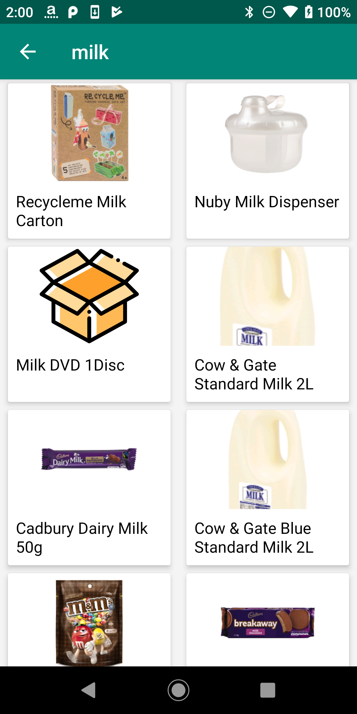

# Ware house search app
 
Simple app to search warehouse products

## Instructions
Create a "subscription_key.properties" and save your warehouse subscription key in following format subscription_key=<yourkey>

## Requirements
* Android SDK 16-28

## Build & Test

**Build**

    ./gradlew :app:assembleDebug

**Test & Coverage**

    ./gradlew :app:testCoverage

## Screenshots

